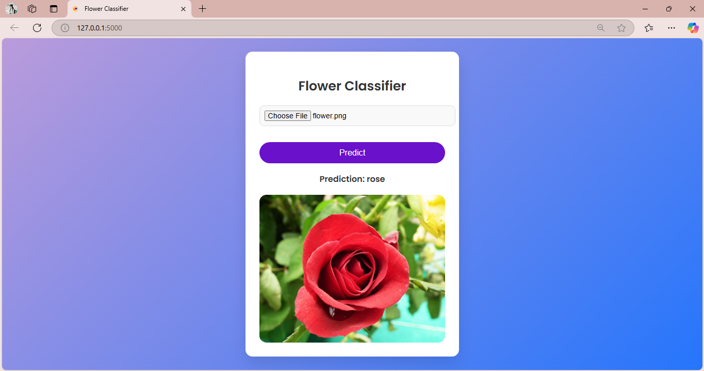
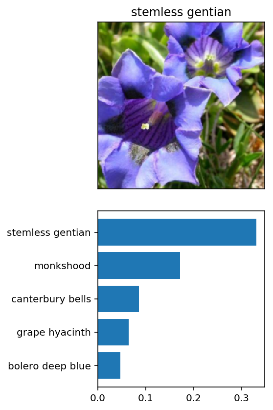

# 🌸 Udacity Image Classifier 🌸

This project is part of the **AI Programming with Python Nanodegree** at **Udacity**. The goal is to build an image classifier that can identify flower species from the **102 Category Flower Dataset** using deep learning techniques.

### 🖼️ **Preview of the App**


You can also test the model by visiting the website http://127.0.0.1:5000 after running `app.py`.

### 🧠 **Project Overview**

The classifier uses a **pre-trained VGG16 model** from PyTorch's torchvision library to classify flower images into one of 102 flower categories. The model was trained on the **ImageNet dataset**, and further fine-tuned using the flower dataset to make predictions.

### ⚙️ **How It Works**
1. **Dataset**: The project is based on the 102 Category Flower Dataset. Images are organized into directories named after their class labels.
2. **Preprocessing**: We resize all images to 224x224 pixels to ensure they are compatible with the VGG16 model.
3. **Model**: We use a Convolutional Neural Network (CNN) architecture, specifically VGG16, which is pre-trained on ImageNet and fine-tuned to predict the 102 flower categories.
4. **Training**: The model is trained for 10 epochs with the following metrics:
    - **Training Accuracy**: ~88%
    - **Validation Accuracy**: ~93%

### 🔧 **Technologies Used**
- **Python**
- **PyTorch**
- **Flask** (for web deployment)
- **Matplotlib** (for visualizing results)
- **Torchvision** (for pre-trained models)

Here’s an updated version including the training step:  

### 🚀 **How to Run the Project**  

1. Clone the repository to your local machine:  
   ```bash
   git clone https://github.com/AstroTech-666/image_classifier.git
   ```  

2. Install the required dependencies:  
   ```bash
   pip install -r requirements.txt
   ```  

3. **Train the Model:**  
   Run one of the following Jupyter notebooks to train the model and generate the `vgg16_bn_checkpoint.pth` file:  
   - `image_classifier_project.ipynb` (for CPU)  
   - `image_classifier_project_GPU.ipynb` (for GPU)  

4. Run the app:  
   ```bash
   python app.py
   ```  

5. Open your browser and go to `http://127.0.0.1:5000/` to interact with the web app and classify flower images.  
   

### 📊 **Model Performance**

- **Training Accuracy**: 94.23%
- **Validation Accuracy**: 95.31%
- **Test Accuracy**: 92.67%

The model performs really well, achieving **over 90% accuracy** on both the validation and test datasets!

### 📝 **How the Classifier Works**
- **Input**: Upload an image of a flower.
- **Output**: The classifier will predict the flower species and display the result with confidence.

### 💡 **Additional Features**
- The app provides a **visual interface** for users to upload images.
- **Live prediction** of flower types based on trained model.

### 📈 **Results**



### 📥 **Future Improvements**
- Increase the model's accuracy by fine-tuning the hyperparameters.
- Implement a more complex neural network architecture to enhance performance.

### 🛠️ **License**
This project is licensed under the **MIT License** - see the [LICENSE](./LICENSE) file for details.
